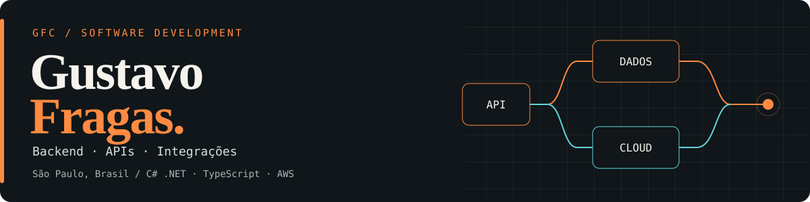

# Oi, eu sou o Gustavo 👋

**Desenvolvedor III na [Alest Consultoria](https://alest.com.br/) · São Paulo, Brasil**

Gosto de pegar aquele processo cheio de etapas manuais, dados espalhados e sistemas que não conversam — e fazer as peças funcionarem juntas. Meu dia a dia passa por **backend, integrações SaaS e automações na AWS**, da implementação aos testes e à documentação.

Código funcionando é o começo. Quero também entender o que aconteceu quando alguma coisa sai do esperado. 🙂

  
  
  

## 🛠️ Minha caixa de ferramentas

  
  
  
  
  
   
  
  
  
  
  

**No trabalho:** Lambda, S3, SQS/DLQ, Amplify, App Runner, Datadog, DocuSign CLM e integrações com Monday e Notion.
**No portfólio:** React + Vite, Motion e Three.js.

## 🚀 Comece por estes projetos

<table>
  <tr>
    <td width="50%" valign="top">
      <h3>🟠 Portfólio pessoal</h3>
      
Meu trabalho em <b>PT · EN · ES</b>: cases anonimizados, visualização interativa e decisões técnicas.

      
<code>React</code> <code>TypeScript</code> <code>Motion</code> <code>Three.js</code>

      
<a href="https://portfolio-pessoal-vert.vercel.app/"><b>Explorar o site ↗</b></a> · <a href="https://github.com/GustavoFragas/Portfolio-Pessoal">Ver código</a>

      
Site estático publicado; backend .NET de referência separado no repositório.

    </td>
    <td width="50%" valign="top">
      <h3>🧠 ATS Optimizer</h3>
      
Adaptação de currículos com PDFs, LLM e perguntas STAR. Instruções contra invenção de experiências, com revisão humana.

      
<code>C# / .NET</code> <code>React</code> <code>TypeScript</code> <code>LLM</code>

      
<a href="https://github.com/GustavoFragas/ats-optimizer"><b>Explorar o projeto ↗</b></a>

      
Projeto pessoal desenvolvido com apoio intenso de IA, testes e direção humana.

    </td>
  </tr>
</table>

📚 **Fundamentos em prática:** [Estacionamento em C# — desafio DIO](https://github.com/GustavoFragas/Sistema-para-Estacionamento) · [CSE 210 — exercícios BYU-Idaho](https://github.com/GustavoFragas/cse210-projects). Projetos de estudo a partir das bases dos cursos.

## ⚙️ O que já coloquei em prática

- **Dados no painel:** migração de Redis/ElastiCache para snapshots no S3, com expiração de 90 dias e fallback para o último snapshot válido.
- **Sistemas conversando:** integrações SaaS, limites de API, qualidade de dados e sincronização.
- **Entrega com evidência:** validação local de SQS/DLQ e workers, Docker, GitHub Actions, Sonar e Gitleaks.

  
<b>🔎 Abrir detalhes da minha participação</b>

- Implementei a migração controlada para S3, a política de expiração e o fallback, com comparação com o cache anterior e acompanhamento da sincronização.
- Trabalhei com Datadog, Notion API, Monday e DocuSign CLM; incluindo filtragem de ruído, limites de API e credenciais separadas por função.
- Participei da evolução e documentação de serviços assíncronos, sob orientação de liderança técnica. Validei localmente consumo, novas tentativas e encaminhamento de falhas para DLQ.
- Publiquei frontend no Amplify e utilizei/revisei configurações de App Runner e Docker, além de participar da validação de entregas.

**[Ver cases no portfólio →](https://portfolio-pessoal-vert.vercel.app/#cases)**

Clientes, código privado, credenciais e informações internas não são publicados.

## 🤖 IA no fluxo. Responsabilidade humana.

Uso **Codex, Kiro, MCPs e cadeias de agentes e subagentes** para apoiar implementação, investigação e revisão. O **Learning Loop** transforma falhas reais em checagens reutilizáveis para as próximas entregas.

> Entender → construir → revisar → testar → aprender.
> A resposta da IA não substitui a validação: escopo, testes e decisão de entrega continuam com pessoas.

## 🌎 Além do código

- 🎓 **Software Development — BYU-Idaho** e **ADS — UFBRA**, em andamento. Técnico em Desenvolvimento de Sistemas pela ETEC Parque Belém.
- 🇦🇷 **Dois anos na Argentina**, em serviço voluntário de tempo integral, de março/2023 a abril/2025.
- 💬 **Português nativo · Espanhol fluente · Inglês B2.**
- 🌱 Aprofundando **Clean Architecture, testes de integração e confiabilidade**, com interesse em operação, segurança e custos na nuvem.

---

**Bora trocar uma ideia?** Me chama no [LinkedIn](https://www.linkedin.com/in/gustavofragascunha/) ou por [e-mail](mailto:gustavofragascunha@gmail.com). Gosto de conversar sobre integração, automação e o que estamos aprendendo no caminho.
